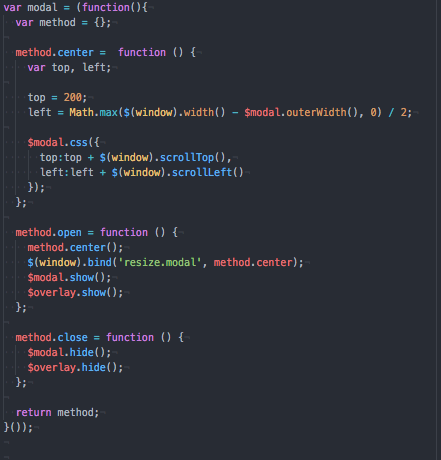
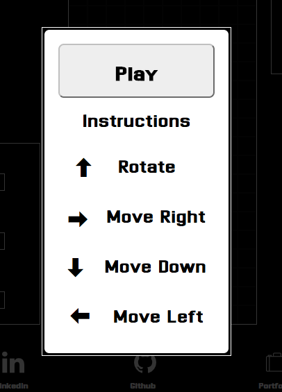

# Tetris

[Play the game here][live]

[live]: https://guitar71989.github.io/Tetris.js/

## Features

A browser Tetris game implemented with Javascript, jQuery, HTML5, and
CSS3.

## Controls:

  * ← move block left
  * → move block right
  * ↑ rotate block 90 degrees clockwise
  * ↓ soft drop

## Screenshots

Upon loading the game, a modal appears with a "Play" button and the basic
game instructions. For the sake of clean code, I created all of the modal-
related html as variables using jQuery, along with a modal function to
call them. Within jQuery's version the DOMContentLoaded event listener,
I opened the modal.

Code Snippet:

User View:

The game uses

Gravity
