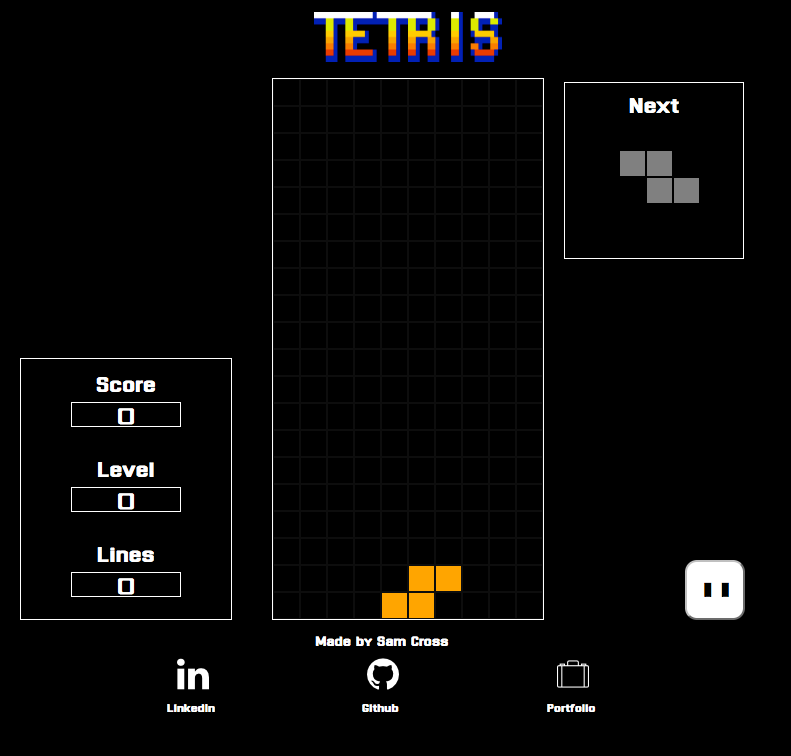

# Tetris

[Play the game here][live]

[live]: https://guitar71989.github.io/Tetris.js/

## Features

A browser Tetris game implemented with Javascript, jQuery, HTML5, and
CSS3.

## Controls:

  * ← move block left
  * → move block right
  * ↑ rotate block 90 degrees clockwise
  * ↓ soft drop

## Intro Modal

Upon loading the game, an introductory modal appears with a "Play" button
and the basic game instructions. For the sake of clean code, I created
all of the modal-related html as variables using jQuery, along with a modal
function to call them. Within jQuery's version the DOMContentLoaded event
listener, I opened the modal.

Code Snippet:

User View:

## Game Layout

Once the user clicks play, the modal closes and a new game is started.
The board consists of three main containers: score, tetris board, and t
he next piece preview. When the game starts, I create two tetris pieces
— currentPiece and nextPiece — the nextPiece sits in the Next Piece
container while the Current Piece begins its descent to the bottom of the
tetris board. The score level and lines are all set at zero when the game
starts as well.

